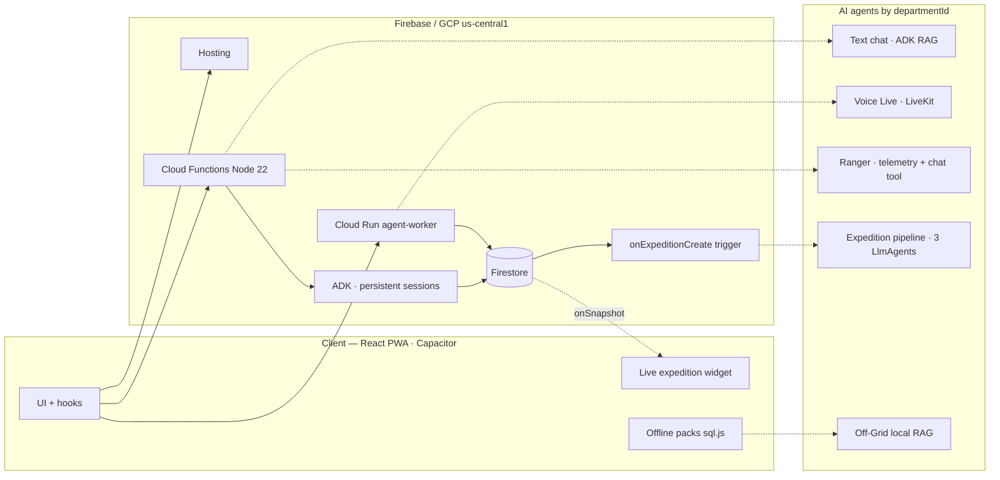

# Hidden App — Expedition Tech Platform

> **Hackathon judges:** Open the [live app](https://gen-lang-client-0040858908.web.app) or install the APK, then tap **Explore as guest** on the login screen for full access without sign-up. Demo video: https://www.youtube.com/watch?v=cTfFi36K3qI

**Hidden App** is an expedition-tech platform for explorers and travelers in Colombia. It combines hyperlocal AI guides, live environmental monitoring, off-grid tools, and community-first tourism — built as a React PWA with a Capacitor Android shell and a Firebase / Google Cloud backend.

**Live app:** https://gen-lang-client-0040858908.web.app

---

## Mission

Hidden App connects adventurers with remote destinations that mainstream platforms often overlook. Through the **Hidden Pact** (*Pacto Hidden*), the platform aims to keep economic value with local guides and communities rather than extractive intermediaries.

---

## What the app does

| Area | Description |
|------|-------------|
| **Hyperlocal chat** | Department-scoped text agent with persistent memory and rich widgets (destinations, coupons, refugios, events, news) |
| **Environmental Ranger** | Live weather, AQI, elevation, and marine telemetry with tactical safety analysis — also callable as a chat tool |
| **Expedition Planner** | Multi-agent pipeline (curator → logistics → writer) that builds day-by-day itineraries from verified catalog data with real Google Routes legs |
| **Modo Live** | Full-duplex voice via LiveKit + Gemini Multimodal Live |
| **Off-Grid Vault** | Downloadable department packs (SQLite) for offline search and chat |
| **Trips & PDF** | Expense log and trip summary export via backend (`generateTripPdf`); destination PDF button temporarily disabled in UI |
| **i18n** | Spanish / English UI and bilingual Firestore content (`*_en` fields) |

---

## Architecture

Public documentation in this repository and on Hosting:

| Resource | Link |
|----------|------|
| **Architecture diagrams (web)** | https://gen-lang-client-0040858908.web.app/architecture.html |
| **Architecture diagrams (source)** | [public/architecture.html](./public/architecture.html) |
| **Demo video** | https://www.youtube.com/watch?v=cTfFi36K3qI |
| **System architecture (markdown)** | [docs/ARCHITECTURE.md](./docs/ARCHITECTURE.md) |



### Text agents (Google ADK)

`chatAgent`, `environmentalAgent`, and the expedition planner run on the [Agent Development Kit](https://adk.dev/) (`@google/adk`):

- **Agentic RAG** — Firestore catalog via `FunctionTool` on demand (not a full KB dump per message)
- **MCP** — Stdio server exposing `hidden_get_*` catalog tools; `MCPToolset` cached per department and clamped server-side
- **Persistent sessions** — `FirestoreSessionService` gives the chat native multi-turn memory across function invocations
- **Agent-as-a-tool** — `getLiveConditions` runs the Ranger as a sub-agent inside a chat turn (live telemetry + tactical analysis)
- **Multi-agent expedition planner** — `planExpedition` enqueues a background pipeline (curator → logistics → writer) grounded in verified catalog data with real Google Routes legs, streamed live to a chat widget
- **Structured JSON** — Stable `message`, `widgets`, and `telemetry` responses
- **Resilience** — Legacy Gemini SDK fallback if ADK fails; PWA contract unchanged

Live voice uses **Cloud Run** (`hidden-agent-worker`) with LiveKit — separate from the text ADK stack.

---

## Tech stack

| Layer | Technologies |
|-------|----------------|
| **Frontend** | React 19, Vite, TypeScript, Tailwind CSS, Framer Motion, Capacitor 8 |
| **Backend** | Firebase (Auth, Firestore, Hosting, Functions Gen 2, FCM, Storage) |
| **AI (cloud text)** | Google ADK, Gemini 2.5 Flash, MCP |
| **AI (voice)** | LiveKit, Gemini Multimodal Live, `@livekit/agents` |
| **AI (offline)** | sql.js packs, local RAG; optional Gemma on-device (roadmap) |
| **Telemetry** | AccuWeather, Open-Meteo, Google AQI, Stormglass (coastal), Google Routes |

---

## Key integrations

- **AccuWeather** — Primary weather telemetry  
- **Open-Meteo** — AQI, cloud cover, elevation  
- **Stormglass** — Marine data for coastal destinations (`isCoastal`)  
- **Google Routes API** — `checkRouteStatus` for traffic, tolls, and ETAs  
- **Rowy CMS** — Editorial content into Firestore  
- **RevenueCat** — Premium membership (native); web uses test flow for development  

API keys are stored in **Firebase Secrets** and local `.env` files (not committed to the repository).

`chatAgent` and `environmentalAgent` require a valid **Firebase ID token** (`Authorization: Bearer …`); the client never trusts a spoofed `userId` in the request body.

---

## Getting started

### Prerequisites

- Node.js 18+ (Functions target Node 22)
- Firebase CLI (`npm install -g firebase-tools`)
- Google Cloud SDK (`gcloud`) for Cloud Run worker deploys

### Install

```bash
git clone https://github.com/hiddenappco/hiddenapp.git
cd hiddenapp

npm install

cd functions && npm install && cd ..
cd agent-worker && npm install && cd ..
```

### Environment

Copy templates and configure secrets locally:

| Location | Purpose |
|----------|---------|
| `.env.local` (root) | Firebase web client config |
| `functions/.env` | `GEMINI_API_KEY`, `GOOGLE_MAPS_API_KEY`, `ACCUWEATHER_API_KEY`, `STORMGLASS_API_KEY` |
| `agent-worker/.env` | `LIVEKIT_*`, `GOOGLE_API_KEY` |

See `functions/.env.example` where available. Never commit real keys.

### Development

```bash
# Frontend dev server
npm run dev

# Build PWA
npm run build

# Build Cloud Functions
cd functions && npm run build
```

### Deploy

```bash
# Cloud Functions (chatAgent, environmentalAgent, packs, cron, etc.)
cd functions && npm run build && cd ..
firebase deploy --only functions

# Static PWA
firebase deploy --only hosting

# Live voice worker
cd agent-worker
gcloud run deploy hidden-agent-worker --source . --region us-central1
```

---

## Documentation in this repository

| Document | Content |
|----------|---------|
| [docs/ARCHITECTURE.md](./docs/ARCHITECTURE.md) | System diagrams, ADK orchestration, agents, deployment |
| [public/architecture.html](./public/architecture.html) | Standalone architecture page (also deployed on Hosting) |
| [LICENSE](./LICENSE) | License terms |
| [COPYRIGHT.txt](./COPYRIGHT.txt) | Copyright notice |

Additional internal dossiers and product roadmaps are maintained outside the public repository.

---

## License

See [LICENSE](./LICENSE) and [COPYRIGHT.txt](./COPYRIGHT.txt).

---

*Hidden App · Expedition-tech for remote tourism in Colombia.*
