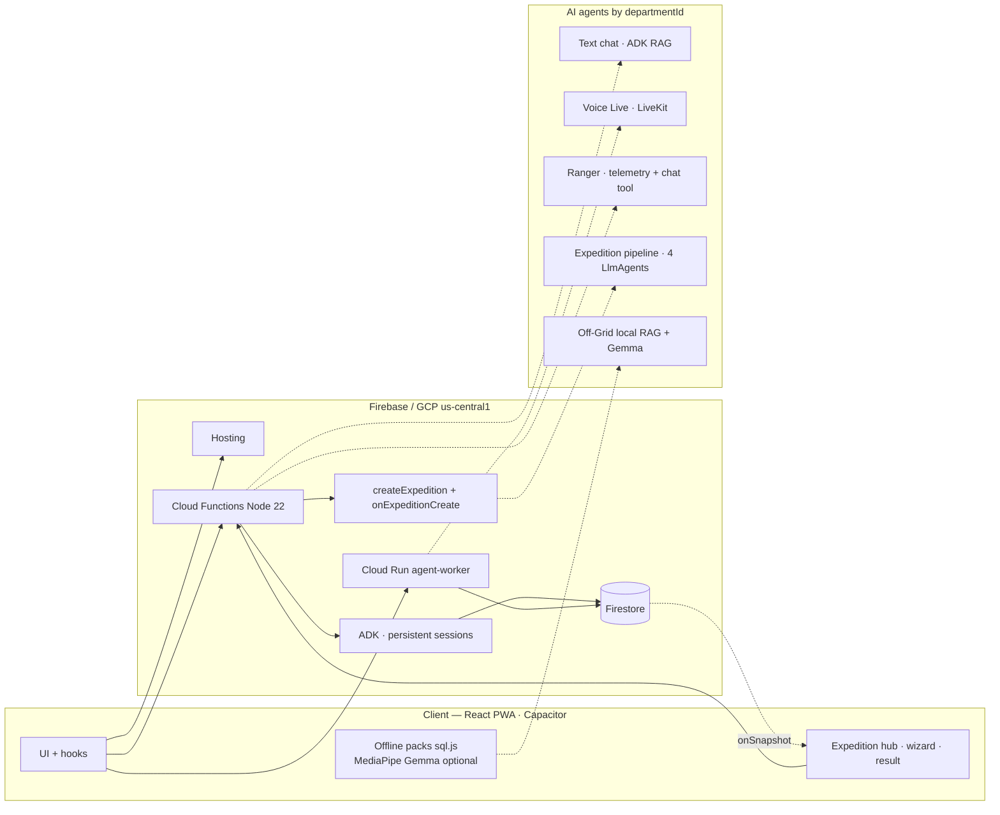

# Hidden App — Expedition Tech Platform

## Challenge submission status

**Google for Startups AI Agents Challenge — Track 2: Optimize**

| | |
|---|---|
| **Official submission snapshot** (tag / branch `submission`) | **Frozen** at commit [`709f760`](https://github.com/hiddenappco/hiddenapp/commit/709f760efa90751731232a2555eea17c9cb46ff4) — **June 11, 2026, 15:35 (-0500)**. Tag [`v1.0-challenge-submission`](https://github.com/hiddenappco/hiddenapp/tree/v1.0-challenge-submission) is **immutable** — do not move it. |
| **Active development** (branch `main`) | **Live product** — **Jun 20, 2026** sprint: group trip activity feed, ranked catalog search, guest→official account upgrade, copyable profile UID, 2-tap expedition planner CTA, B2B pricing documented. Changelog: [`docs/SUBMISSION.md`](./docs/SUBMISSION.md). |
| **Release notes** | [GitHub Release](https://github.com/hiddenappco/hiddenapp/releases/tag/v1.0-challenge-submission) · [draft text](./docs/RELEASE_v1.0-challenge-submission.md) |
| **Full guide for judges** | [docs/SUBMISSION.md](./docs/SUBMISSION.md) |
| **Business model (public)** | [docs/UNIT_ECONOMICS_EN.md](./docs/UNIT_ECONOMICS_EN.md) — pricing, B2B ($15/mo · $150/yr), market sizing (English, judge-facing) |

### Quick start for judges

1. **Try the app (no install):** [Live PWA](https://gen-lang-client-0040858908.web.app) → tap **Explore as guest** on the login screen.  
2. **Demo video (Devpost):** https://www.youtube.com/watch?v=cTfFi36K3qI  
3. **Audit submission code:**

```bash
git clone https://github.com/hiddenappco/hiddenapp.git
cd hiddenapp
git checkout v1.0-challenge-submission   # or: git checkout submission
npm install && cd functions && npm install && cd .. && cd agent-worker && npm install && cd ..
# Configure .env files — see § Environment below (keys are not in the repo)
npm run dev
```

4. **See what shipped after the challenge:**

```bash
git checkout main
git log v1.0-challenge-submission..main --oneline
```

> **Two worlds, one repo:** Judges auditing the **formal deliverable** should `git checkout v1.0-challenge-submission` (or `submission`) — that is the cognitive core frozen before the Devpost deadline. Judges evaluating **momentum and production discipline** should browse **`main`**: continuous commits after June 11 prove active startup development, not a weekend hackathon toy.

---

**Hidden App** is an expedition-tech platform for explorers and travelers in Colombia. It combines hyperlocal AI guides, live environmental monitoring, off-grid tools, and community-first tourism — built as a React PWA with a Capacitor Android shell and a Firebase / Google Cloud backend.

**Live app:** https://gen-lang-client-0040858908.web.app

---

## Mission

Hidden App connects adventurers with remote destinations that mainstream platforms often overlook. Through the **Hidden Pact** (*Pacto Hidden*), the platform aims to keep economic value with local guides and communities rather than extractive intermediaries.

---

## What the app does

| Area | Description |
|------|-------------|
| **Hyperlocal chat** | Department-scoped text agent; catalog tools return **`planningNotes`** when present; multi-day trips → expedition hub |
| **Environmental Ranger** | Live weather, AQI, elevation, marine telemetry + localized destination ficha (**`planningNotes`**) — also callable as a chat tool |
| **Expedition Planner** | Dedicated hub (`/expedition/plan`) with department picker + **5-step wizard**; **«Mis planes anteriores»** (20 plans, real-time list); multi-agent pipeline grounded in catalog fichas including **`planningNotes`**, `groundMobility`, Google Routes legs (up to 45), coupon widgets, COP budget, mobility badge in result + expedition PDF |
| **Modo Live** | Full-duplex voice via LiveKit + Gemini Multimodal Live; token and usage quota via authenticated Cloud Functions (`generateLiveKitToken`, `recordLiveCallSeconds`) |
| **Off-Grid Vault** | Downloadable department packs (SQLite) for offline search and chat; optional **MediaPipe Gemma 2B IT GPU** (~1.29 GB) for on-device generative chat (WebGPU) |
| **Trip ledger (Bitácora v2)** | Solo trips free; group trips Premium (`tripCode`, roles owner/editor/observer). COP canonical ledger with multi-currency entry (COP/USD/EUR), TRM-backed rates, Tricount-style splits and balances, offline outbox (IndexedDB) + sync on reconnect, **completed-trip history offline** (mirror up to 10), **group activity feed** (`trips/{id}/activity` — expense added/deleted, member joined), bilingual trip PDF |
| **Catalog search** | Relevance-ranked picker search (`rankLocalizedSearch`) on Monitor, Destinations, Refugios, Coupons, News, and expedition must-visit — title/name/location only; accent-insensitive multi-word queries |
| **Guest upgrade** | Anonymous guest links Google or email/password in Profile Settings without changing UID (`linkWithCredential`); `isGuest: false` while hackathon Premium bypass remains (`GUEST_HACKATHON_PREMIUM`) |
| **Premium** | `/premium` — account types, Free vs Premium compare table, USD reference pricing; store checkout disabled until Play/App Store (`PREMIUM_CHECKOUT_ENABLED`); contextual `HelpTooltip` with viewport-safe portal positioning |
| **Exchange rates** | Daily official TRM (datos.gov.co) + EUR cross-rate; `getExchangeRates` + `scheduledExchangeRates` cache in `config/exchangeRates` |
| **i18n** | Spanish / English UI, bilingual Firestore content (`*_en` fields), and bilingual trip PDF export |
| **Thumb navigation** | Floating glass bottom bar on 5 hub routes (Destinations · Monitor · Departments · Ledger · Refuges); full catalog in the lateral drawer; safe-area spacing on iOS/Android |

---

## Repository layout (Git)

```
main                          ← latest product code (default branch)
submission                    ← frozen at challenge close (same as tag)
v1.0-challenge-submission     ← immutable tag on 709f760 (Jun 11, 2026)
```

| Path | Description |
|------|-------------|
| [`docs/SUBMISSION.md`](./docs/SUBMISSION.md) | Challenge snapshot vs `main`, checkout commands, GCP stack summary |
| [`docs/ARCHITECTURE.md`](./docs/ARCHITECTURE.md) | System diagrams, ADK, agents, client navigation, deployment |
| [`docs/UI_FIELD_CONSTRAINTS.md`](./docs/UI_FIELD_CONSTRAINTS.md) | Touch targets, thumb-zone bar, safe-area tokens |
| `components/` | React UI (PWA + Capacitor) |
| `functions/src/` | Cloud Functions source (ADK, APIs) — build output `functions/lib/` is gitignored |
| `agent-worker/` | Cloud Run Live voice worker |

---

## Architecture

Public documentation in this repository and on Hosting:

| Resource | Link |
|----------|------|
| **Architecture diagrams (web)** | https://gen-lang-client-0040858908.web.app/architecture.html |
| **Architecture diagrams (source)** | [public/architecture.html](./public/architecture.html) |
| **Demo video** | https://www.youtube.com/watch?v=cTfFi36K3qI |
| **System architecture (markdown)** | [docs/ARCHITECTURE.md](./docs/ARCHITECTURE.md) |


```mermaid
flowchart LR
    subgraph Client["Client — React PWA · Capacitor"]
        UI[UI + hooks]
        EXPH[Expedition hub · wizard · result]
        OFF[Offline packs sql.js<br/>MediaPipe Gemma optional]
    end

    subgraph GCP["Firebase / GCP us-central1"]
        HOST[Hosting]
        FS[(Firestore)]
        CFN[Cloud Functions Node 22]
        ADK[ADK · persistent sessions]
        EXP[createExpedition + onExpeditionCreate]
        RUN[Cloud Run agent-worker]
    end

    subgraph Agents["AI agents by departmentId"]
        A1[Text chat · ADK RAG]
        A2[Voice Live · LiveKit]
        A3[Ranger · telemetry + chat tool]
        A5[Expedition pipeline · 4 LlmAgents]
        A4[Off-Grid local RAG + Gemma]
    end

    UI --> HOST
    UI --> CFN
    UI --> RUN
    EXPH --> CFN
    CFN --> ADK
    ADK --> FS
    CFN --> EXP
    EXP -.-> A5
    FS -.->|onSnapshot| EXPH
    RUN --> FS
    OFF -.-> A4
    CFN -.-> A1
    RUN -.-> A2
    CFN -.-> A3
```

### Text agents (Google ADK)

`chatAgent`, `environmentalAgent`, and the expedition planner run on the [Agent Development Kit](https://adk.dev/) (`@google/adk`):

- **Agentic RAG** — Firestore catalog via `FunctionTool` on demand (not a full KB dump per message)
- **MCP** — Stdio server exposing `hidden_get_*` catalog tools; `MCPToolset` cached per department and clamped server-side
- **Persistent sessions** — `FirestoreSessionService` gives the chat native multi-turn memory across function invocations
- **Agent-as-a-tool** — `getLiveConditions` runs the Ranger as a sub-agent inside a chat turn (live telemetry + tactical analysis)
- **Multi-agent expedition planner** — Trip Planner hub (`/expedition/plan` → 5-step wizard with **`groundMobility`** → `createExpedition`); background pipeline (curator → logistics → budget → writer) uses full catalog fichas + **`planningNotes`**; validated ids, Google Routes legs, coupon widgets, mobility badge + PDF, live progress via `onSnapshot` on `expeditions/{id}`. Chat redirects multi-day trips to the hub; `planExpedition` requires mobility when used from chat
- **Structured JSON** — Stable `message`, `widgets`, and `telemetry` responses
- **Resilience** — Legacy Gemini SDK fallback if ADK fails; PWA contract unchanged

Live voice uses **Cloud Run** (`hidden-agent-worker`) with LiveKit — separate from the text ADK stack.

---

## Tech stack

| Layer | Technologies |
|-------|----------------|
| **Frontend** | React 19, Vite, TypeScript, Tailwind CSS, Framer Motion, Capacitor 8 |
| **Backend** | Firebase (Auth, Firestore, Hosting, Functions Gen 2, FCM, Storage) |
| **AI (cloud text)** | Google ADK, Gemini 2.5 Flash + Pro (expedition curator/logistics/budget), MCP |
| **AI (voice)** | LiveKit, Gemini Multimodal Live, `@livekit/agents` |
| **AI (offline)** | sql.js packs, local RAG; **MediaPipe Gemma 2B IT GPU int4** (`@mediapipe/tasks-genai`, WebGPU) — optional download from Firebase Storage |
| **Telemetry** | AccuWeather, Open-Meteo, Google AQI, Stormglass (coastal), Google Routes |

---

## Key integrations

- **AccuWeather** — Primary weather telemetry  
- **Open-Meteo** — AQI, cloud cover, elevation  
- **Stormglass** — Marine data for coastal destinations (`isCoastal`)  
- **Google Routes API** — `checkRouteStatus` for traffic, tolls, and ETAs  
- **Rowy CMS** — Editorial content into Firestore  
- **datos.gov.co TRM** — Official COP/USD rate for trip ledger and currency converter  
- **Frankfurter** — USD→EUR cross-rate for multi-currency expenses  
- **RevenueCat** — Premium membership (native); web uses test flow for development — required for **group** trip create/join  

API keys are stored in **Firebase Secrets** and local `.env` files (not committed to the repository).

`chatAgent` and `environmentalAgent` require a valid **Firebase ID token** (`Authorization: Bearer …`); the client never trusts a spoofed `userId` in the request body.

---

## Getting started

### Prerequisites

- Node.js 18+ (Functions target Node 22)
- Firebase CLI (`npm install -g firebase-tools`)
- Google Cloud SDK (`gcloud`) for Cloud Run worker deploys

### Install

```bash
git clone https://github.com/hiddenappco/hiddenapp.git
cd hiddenapp

npm install

cd functions && npm install && cd ..
cd agent-worker && npm install && cd ..
```

### Environment

Copy templates and configure secrets locally:

| Location | Purpose |
|----------|---------|
| `.env.local` (root) | Firebase web client config; optional `VITE_GEMMA_MODEL_URL` |
| `functions/.env` | `GEMINI_API_KEY`, `GOOGLE_MAPS_API_KEY`, `ACCUWEATHER_API_KEY`, `STORMGLASS_API_KEY` |
| `agent-worker/.env` | `LIVEKIT_*`, `GOOGLE_API_KEY` |

See `functions/.env.example` where available. Never commit real keys.

### Development

```bash
# Frontend dev server
npm run dev

# Build PWA
npm run build

# Build Cloud Functions
cd functions && npm run build
```

### Deploy

```bash
# Full stack (prefer small function batches if Cloud Run CPU quota errors)
npm run build
cd functions && npm run build && cd ..
firebase deploy --only hosting,firestore:rules,firestore:indexes,storage
firebase deploy --only functions   # or: functions:createExpedition,functions:chatAgent, …

# Expedition planner only (faster iteration)
firebase deploy --only functions:createExpedition,functions:onExpeditionCreate

# Trip ledger — TRM cache + bilingual trip PDF
firebase deploy --only functions:getExchangeRates,functions:scheduledExchangeRates,functions:generateTripPdf

# Firestore rules + indexes (group trips, expedition history)
firebase deploy --only firestore:indexes,firestore:rules

# Static PWA
firebase deploy --only hosting

# Live voice worker
cd agent-worker
gcloud run deploy hidden-agent-worker --source . --region us-central1
```

**Production (Jun 2026):** https://gen-lang-client-0040858908.web.app — hosting, Firestore rules/indexes, Storage rules, and all Cloud Functions deployed. Deploy functions **one at a time** if you hit `Quota exceeded for total allowable CPU per project per region` on Cloud Run.

---

## Documentation in this repository

| Document | Content |
|----------|---------|
| [docs/SUBMISSION.md](./docs/SUBMISSION.md) | **Challenge snapshot** — tag, branch, checkout, post-submission changelog |
| [docs/ARCHITECTURE.md](./docs/ARCHITECTURE.md) | System diagrams, ADK orchestration, agents, client navigation, deployment |
| [docs/UI_FIELD_CONSTRAINTS.md](./docs/UI_FIELD_CONSTRAINTS.md) | Touch targets, thumb-zone bar, safe-area tokens, tooltips P0 (P0 QA checklist) |
| [docs/UNIT_ECONOMICS_EN.md](./docs/UNIT_ECONOMICS_EN.md) | **Business model & unit economics** — pricing, B2B ($15/mo · $150/yr), market, projections (EN) |
| [docs/UNIT_ECONOMICS_ES.md](./docs/UNIT_ECONOMICS_ES.md) | **Modelo de negocio y unit economics** — misma política B2B, mercado Colombia/LATAM (ES) |
| [docs/PREMIUM_ENTITLEMENTS.md](./docs/PREMIUM_ENTITLEMENTS.md) | Feature matrix by tier — Guest · Free · Premium (Jun 2026) |
| [docs/SESION_TRABAJO.md](./docs/SESION_TRABAJO.md) | Session log — latest product work (Spanish, internal) |
| [roadmap_integraciones.md](./roadmap_integraciones.md) | Integration roadmap — tasks & completion status |
| [public/architecture.html](./public/architecture.html) | Standalone architecture page (also deployed on Hosting) |
| [LICENSE](./LICENSE) | License terms |
| [COPYRIGHT.txt](./COPYRIGHT.txt) | Copyright notice |

Internal roadmaps and financial dossiers may exist locally but are not required to run or evaluate the app.

---

## License

See [LICENSE](./LICENSE) and [COPYRIGHT.txt](./COPYRIGHT.txt).

---

*Hidden App · Expedition-tech for remote tourism in Colombia.*
