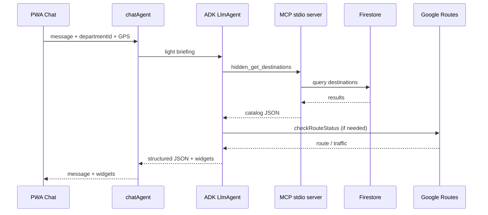
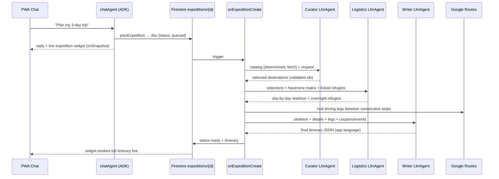

# Hidden App — System Architecture

Expedition-tech platform for remote tourism in Colombia — PWA, Capacitor Android, Firebase/GCP backend, and a multi-agent AI ecosystem scoped by `departmentId`: four user-facing agents plus a **multi-agent expedition planner pipeline** (curator → logistics → writer).

| Resource | URL |
|----------|-----|
| **Production PWA** | https://gen-lang-client-0040858908.web.app |
| **Architecture diagrams (standalone web)** | https://gen-lang-client-0040858908.web.app/architecture.html |
| **Architecture diagrams (source)** | [`public/architecture.html`](../public/architecture.html) |
| **Hackathon demo video** | https://www.youtube.com/watch?v=cTfFi36K3qI |
| **Source code** | https://github.com/hiddenappco/hiddenapp |
| **README** | [`README.md`](../README.md) |

---

## Unified architecture diagram

GitHub renders the diagram below automatically. The same diagram is also available as a standalone page at the **Architecture diagram** link above.

```mermaid
flowchart TB
    subgraph USERS["USERS"]
        U["Explorer / Tourist<br/>PWA browser · Android Capacitor"]
    end

    subgraph CLIENT["CLIENT — React 19 + Vite + Capacitor 8"]
        direction TB
        UI["UI: Home · Destinations · Chat · Live · Monitor<br/>Profile · Off-Grid · Trips · Coupons"]
        HOOKS["hooks + contexts<br/>Auth · i18n EN/ES · Theme"]
        SVC["services<br/>environmental · firebase · PDF · premium"]
        OFF["Offline: sql.js + department packs"]
    end

    subgraph FIREBASE["FIREBASE / GCP — gen-lang-client-0040858908 · us-central1"]
        direction TB
        HOST["Firebase Hosting<br/>.web.app"]
        AUTH["Firebase Auth<br/>Email · Google OAuth"]
        FS[("Cloud Firestore")]
        ST["Cloud Storage<br/>images · PDFs"]
        FCM["FCM Push"]

        subgraph CFN["Cloud Functions Gen 2 · Node 22"]
            CHAT["chatAgent<br/>ADK · Agentic RAG · MCP"]
            ENV["environmentalAgent<br/>ADK Ranger"]
            EXPD["onExpeditionCreate<br/>multi-agent planner trigger"]
            PDF["generateTripPdf"]
            LKT["generateLiveKitToken"]
            PACK["department packs + Rowy triggers"]
            CRON["scheduledEnvironmentalMonitor<br/>+ entity alerts"]
        end

        subgraph ADK["ADK runtime · functions/src/adk"]
            RUNNER["Runner + FirestoreSessionService<br/>persistent multi-turn memory"]
            CHATAG["LlmAgent · hyperlocal chat"]
            RANGER["LlmAgent · environmental<br/>also exposed as getLiveConditions tool"]
            MCP_TS["MCPToolset<br/>per-department scoped"]
            EXPIPE["Expedition pipeline<br/>curator → logistics → writer"]
        end

        MCP_SRV["MCP stdio server<br/>hidden_get_* tools"]

        RUN["Cloud Run<br/>hidden-agent-worker<br/>Live voice"]
    end

    subgraph AGENTS["AI AGENTS — scoped by departmentId"]
        direction LR
        A1["Hyperlocal Chat<br/>Gemini 2.5 Flash · widgets"]
        A2["Hyperlocal Live<br/>Gemini Multimodal Live"]
        A3["Environmental Ranger<br/>weather + activity progress"]
        A4["Off-Grid Vault<br/>local RAG · no network"]
        A5["Expedition Planner<br/>3 sequential LlmAgents"]
    end

    subgraph DATA["FIRESTORE — core collections"]
        direction LR
        D1["users<br/>premium · activeMonitor · completedActivities"]
        D2["departments + assistants"]
        D3["destinations<br/>coords · activities · refugios"]
        D4["environmental_cache"]
        D5["trips · Events · Coupons · News"]
        D6["expeditions<br/>live pipeline status + itinerary"]
        D7["adk_sessions<br/>persistent chat memory"]
    end

    subgraph EXTERNAL["EXTERNAL SERVICES"]
        direction LR
        GEM["Google Gemini"]
        LK["LiveKit Cloud WebRTC"]
        W["AccuWeather · Open-Meteo<br/>Stormglass · Google Maps"]
        ROWY["Rowy CMS → content"]
    end

    subgraph SHIELD["ENVIRONMENTAL SHIELD FLOW"]
        direction LR
        S1["Destination + coords"] --> S2["SHIELD ON<br/>activeMonitor"]
        S2 --> S3["Ranger every 15 min<br/>while app open"]
        S2 --> S4["Cron every 15 min<br/>push UV / AQI / rain"]
        S3 --> S5["Tactical Q&A<br/>separate thread UI"]
    end

    U --> UI
    HOST --> UI
    UI --> HOOKS --> SVC
    UI --> OFF
    SVC --> AUTH
    SVC --> FS
    SVC --> ST
    SVC --> FCM

    UI -->|HTTPS| CHAT
    UI -->|HTTPS| ENV
    UI -->|HTTPS| PDF
    UI -->|HTTPS| LKT
    UI -->|WebRTC| LK

    CHAT --> RUNNER
    ENV --> RUNNER
    EXPD --> EXPIPE
    RUNNER --> CHATAG
    RUNNER --> RANGER
    RUNNER --> D7
    CHATAG --> MCP_TS
    CHATAG -->|getLiveConditions| RANGER
    CHATAG -->|planExpedition| D6
    D6 --> EXPD
    EXPIPE --> D6
    EXPIPE --> W
    MCP_TS --> MCP_SRV
    MCP_SRV --> FS
    CHATAG --> FS
    CHAT --> FS
    ENV --> FS
    ENV --> D4
    PACK --> FS
    CRON --> FS
    CRON --> FCM
    CRON --> W
    PDF --> ST

    CHAT --> GEM
    ENV --> GEM
    ENV --> W
    EXPIPE --> GEM
    LKT --> LK
    LK --> RUN
    RUN --> GEM
    RUN --> FS
    RUN --> W

    ROWY --> FS
    FS --> D1 & D2 & D3 & D5
    D3 --> D4
    D6 -.->|onSnapshot live widget| UI

    CHAT -.-> A1
    RUN -.-> A2
    ENV -.-> A3
    OFF -.-> A4
    EXPIPE -.-> A5
    D2 -.-> A1 & A2
    D3 -.-> A3
    D1 -.-> A3

    UI -.-> SHIELD
    ENV -.-> SHIELD
    CRON -.-> SHIELD

    FCM --> U
```



---

## Legend

| Zone | Meaning |
|------|---------|
| **Client** | React PWA and Capacitor Android shell |
| **Firebase** | Auth, Firestore, Hosting, Functions, FCM |
| **ADK runtime** | `@google/adk` orchestration inside Cloud Functions — persistent sessions, agent-as-a-tool, multi-agent pipeline |
| **AI agents** | Specialized agents with `departmentId` isolation |
| **Firestore** | Content and user state feeding UI and agents |
| **External** | Third-party APIs (keys in Firebase Secrets, not in repo) |
| **Shield** | One monitored destination; Ranger refresh + push alerts |

---

## The agents

| Agent | Runtime | Model | ADK |
|-------|---------|-------|-----|
| Hyperlocal chat (text) | Cloud Functions `chatAgent` | Gemini 2.5 Flash | Yes — Agentic RAG + MCP + persistent sessions |
| Environmental Ranger (text) | Cloud Functions `environmentalAgent` | Gemini 2.5 Flash | Yes — structured JSON; also callable as `getLiveConditions` tool from the chat |
| Expedition Planner (pipeline) | Cloud Functions `onExpeditionCreate` (background trigger) | Gemini 2.5 Flash × 3 | Yes — curator → logistics → writer sequential pipeline |
| Hyperlocal Live (voice) | Cloud Run `hidden-agent-worker` | Gemini Multimodal Live | No — LiveKit Agents |
| Off-Grid Vault | Client (Capacitor + sql.js) | Local RAG / Gemma (roadmap) | No — edge offline |

---

## Agent orchestration

Text agents (`chatAgent`, `environmentalAgent`) run on the [Agent Development Kit](https://adk.dev/) (`@google/adk` v1.2+). HTTP handlers in `functions/src/api/agents.ts` preserve the client contract (`message`, `widgets`, `telemetry`). If an ADK turn fails, the handler falls back to the legacy `@google/generative-ai` SDK without breaking the PWA.

### Hyperlocal chat (`chatAgent`)

The chat agent no longer embeds the full knowledge base in every prompt. It receives a **light briefing** (assistant profile, rules, active department, GPS) and fetches catalog data on demand via tools (ReAct pattern). Conversation history is **not** re-injected per prompt: each chat (`chatId`) maps to a **persistent ADK session** stored in Firestore (`FirestoreSessionService`, `adk_sessions` collection), so the `Runner` natively replays multi-turn memory across Cloud Function invocations.



| Layer | Implementation |
|-------|----------------|
| **Agentic RAG** | `FunctionTool` queries Firestore on demand (`getDepartment`, `getDestinations`, `getRefugios`, `getCoupons`, `getEvents`, `getNews`) |
| **MCP** | Stdio MCP server (`functions/src/mcp/stdioEntry.ts`) exposes `hidden_get_*` tools; ADK `MCPToolset` connects when the child process is available |
| **Persistent sessions** | `FirestoreSessionService` (`BaseSessionService`) — sessions in `adk_sessions/{appName__userId__sessionId}` with an `events` subcollection; native multi-turn memory |
| **Hermetic scoping** | FunctionTools take no `departmentId` param (session context only); MCP toolsets cached **per department** and clamped via `HIDDEN_MCP_DEPARTMENT` env in the child process |
| **Routes** | `checkRouteStatus` `FunctionTool` (Google Routes API) — per-request GPS closure |
| **Agent-as-a-tool** | `getLiveConditions` `FunctionTool` fetches real telemetry and invokes the **Ranger sub-agent** for a tactical analysis inside the chat turn |
| **Multi-agent planner** | `planExpedition` `FunctionTool` enqueues an `expeditions/{id}` doc; background pipeline (curator → logistics → writer) streams progress to the live chat widget |
| **Structured output** | `outputSchema` + `application/json` for stable widgets |
| **Widget validation** | `sanitizeChatWidgets` / `enrichChatWidgets` verify ids against the live catalog |
| **Payload trimming** | `stripHeavyMediaFields` removes galleries/images from tool results before they enter the model context |
| **Observability** | `getGcpExporters` + `maybeSetOtelProviders` — Cloud Trace / Monitoring |
| **Resilience** | MCP unavailable → FunctionTool RAG; ADK failure → legacy Gemini SDK with full KB prompt |

**Chat tools:**

| Tool | Type | Purpose |
|------|------|---------|
| `hidden_get_department` | MCP | Department profile (culture, logistics, safety, seasonality) |
| `hidden_get_destinations` | MCP | Destinations; optional text filter |
| `hidden_get_refugios` | MCP | Active lodging; filter by `destinationId` |
| `hidden_get_coupons` | MCP | Partner coupons |
| `hidden_get_events` | MCP | Fairs and events |
| `hidden_get_news` | MCP | News and announcements |
| `getDepartment` … `getNews` | FunctionTool | Same catalog via native ADK when MCP is down |
| `checkRouteStatus` | FunctionTool | Routes, traffic, tolls |
| `getLiveConditions` | FunctionTool (agent-as-a-tool) | Live weather/AQI/marine telemetry + Ranger tactical analysis for a destination |
| `planExpedition` | FunctionTool | Enqueues the multi-agent expedition planner (days, origin, interests, budget) |

### Environmental Ranger (`environmentalAgent`)

Tactical agent that interprets live telemetry (AccuWeather, Open-Meteo, AQI, elevation, Stormglass when `isCoastal`) and explorer checklist progress. Implemented as `LlmAgent` with **`outputSchema`** (`message` in JSON). Integrated with **Environmental Shield**: 15-minute refresh while the app is open, plus cron push alerts for UV, AQI, and rain thresholds. Also exposed to the chat agent as the `getLiveConditions` tool (agent-as-a-tool pattern).

### Multi-agent Expedition Planner (`onExpeditionCreate`)

The flagship workflow-agent feature: *"plan me a 3-day expedition"* in the chat triggers an asynchronous pipeline of **three specialist ADK agents**, grounded exclusively in verified catalog data.



Pipeline guarantees:

- **Deterministic gathering** — catalog data is fetched by code, not by the LLM (zero hallucination surface for ids).
- **Validated handoffs** — destination and refugio ids from each agent are checked against the catalog; invalid picks are dropped.
- **Real geography** — straight-line matrix for ordering decisions, then Google Routes driving legs (max 10) injected deterministically into the final itinerary.
- **Catalog honesty** — if the catalog can't support the requested days, the curator says so (`NOT_FEASIBLE` + honest note in the widget).
- **Live UX** — `expeditions/{id}.status` transitions (`queued → curating → routing → writing → ready`) stream to the chat widget via `onSnapshot`.

### Live voice (`hidden-agent-worker`)

Full-duplex voice via **LiveKit** + **Gemini Multimodal Live** on Cloud Run. Separate from the text ADK stack; uses `@livekit/agents` with department isolation from the LiveKit room name.

### Off-Grid Vault

Client-side SQLite department packs (`sql.js` + Capacitor). Local RAG and guided search without network; optional on-device Gemma on the roadmap.

---

## ADK code layout

```
functions/src/adk/
  config.ts, runner.ts, telemetry.ts, parseJson.ts
  chat/agent.ts, chat/run.ts, chat/briefing.ts
  chat/knowledge.ts, chat/ragTools.ts, chat/tools.ts
  chat/rangerTool.ts      ← getLiveConditions (agent-as-a-tool)
  chat/expeditionTool.ts  ← planExpedition (enqueues pipeline)
  ranger/agent.ts, ranger/run.ts
  expedition/agents.ts    ← curator · logistics · writer LlmAgents
  expedition/run.ts       ← sequential pipeline orchestration
  sessions/firestoreSessionService.ts ← persistent ADK sessions
  mcp/catalogToolset.ts
functions/src/mcp/
  stdioEntry.ts, registerCatalogTools.ts
functions/src/api/agents.ts       ← HTTP entrypoints + legacy fallback
functions/src/api/expeditions.ts  ← onExpeditionCreate trigger
```

---

## Security

API keys (Gemini, Maps, weather providers, LiveKit) are **not** in the public repository. They are configured via Firebase Secrets and local `.env` files excluded by `.gitignore`. The PWA bundle only includes public Firebase web client configuration.

`chatAgent` and `environmentalAgent` verify a Firebase ID token on every request; the authenticated UID from the token is used for Firestore access — not a client-supplied `userId`.

---

## Deployment

| Component | Command / target |
|-----------|------------------|
| Cloud Functions | `cd functions && npm run build && firebase deploy --only functions` |
| Firebase Hosting | `firebase deploy --only hosting` |
| Live agent worker | `gcloud run deploy hidden-agent-worker --source ./agent-worker` |

Secrets (Firebase): `GEMINI_API_KEY`, `GOOGLE_MAPS_API_KEY`, `ACCUWEATHER_API_KEY`, `STORMGLASS_API_KEY`.

---

*Hidden App · Expedition-tech platform for remote tourism in Colombia.*
