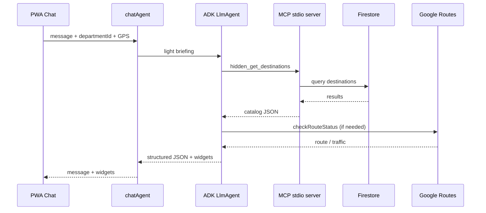
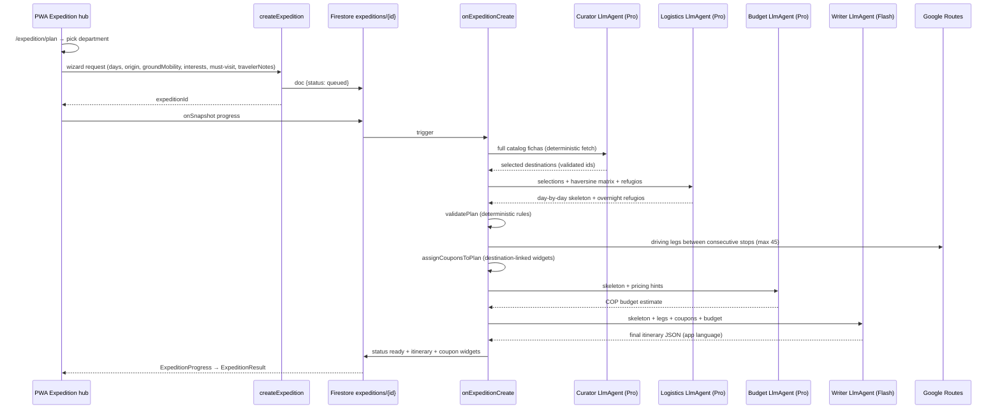

# Hidden App — System Architecture

Expedition-tech platform for remote tourism in Colombia — PWA, Capacitor Android, Firebase/GCP backend, and a multi-agent AI ecosystem scoped by `departmentId`: four user-facing agents plus a **multi-agent expedition planner pipeline** (curator → logistics → budget → writer) exposed as a dedicated Trip Planner hub.

| Resource | URL |
|----------|-----|
| **Production PWA** | https://gen-lang-client-0040858908.web.app |
| **Architecture diagrams (standalone web)** | https://gen-lang-client-0040858908.web.app/architecture.html |
| **Architecture diagrams (source)** | [`public/architecture.html`](../public/architecture.html) |
| **Product overview video** | https://www.youtube.com/watch?v=cTfFi36K3qI |
| **Source code** | https://github.com/hiddenappco/hiddenapp |
| **README** | [`README.md`](../README.md) |

---

## Unified architecture diagram

GitHub renders the diagram below automatically. The same diagram is also available as a standalone page at the **Architecture diagram** link above.


```mermaid
flowchart TB
    subgraph USERS["USERS"]
        U["Explorer / Tourist<br/>PWA browser · Android Capacitor"]
    end

    subgraph CLIENT["CLIENT — React 19 + Vite + Capacitor 8"]
        direction TB
        UI["UI: Home · Destinations · Chat · Live · Monitor<br/>Profile · Off-Grid · Trips · Coupons<br/>Expedition hub · wizard · result"]
        HOOKS["hooks + contexts<br/>Auth · i18n EN/ES · Theme"]
        SVC["services<br/>environmental · firebase · PDF · premium"]
        OFF["Offline: sql.js + department packs<br/>tripLedgerStore IndexedDB outbox"]
    end

    subgraph FIREBASE["FIREBASE / GCP — gen-lang-client-0040858908 · us-central1"]
        direction TB
        HOST["Firebase Hosting<br/>.web.app"]
        AUTH["Firebase Auth<br/>Email · Google OAuth"]
        FS[("Cloud Firestore")]
        ST["Cloud Storage<br/>images · PDFs"]
        FCM["FCM Push"]

        subgraph CFN["Cloud Functions Gen 2 · Node 22"]
            CHAT["chatAgent<br/>ADK · Agentic RAG · MCP"]
            ENV["environmentalAgent<br/>ADK Ranger"]
            EXPD["createExpedition + onExpeditionCreate<br/>multi-agent planner"]
            PDF["generateTripPdf<br/>bilingual trip ledger"]
            FX["getExchangeRates + scheduledExchangeRates<br/>TRM cache"]
            LKT["generateLiveKitToken<br/>recordLiveCallSeconds"]
            ESG["onTripExpenseWritten<br/>direct economic injection"]
            PACK["department packs + Rowy triggers"]
            CRON["scheduledEnvironmentalMonitor<br/>+ entity alerts"]
        end

        subgraph ADK["ADK runtime · functions/src/adk"]
            RUNNER["Runner + FirestoreSessionService<br/>persistent multi-turn memory"]
            CHATAG["LlmAgent · hyperlocal chat"]
            RANGER["LlmAgent · environmental<br/>also exposed as getLiveConditions tool"]
            MCP_TS["MCPToolset<br/>per-department scoped"]
            EXPIPE["Expedition pipeline<br/>curator → logistics → budget → writer"]
        end

        MCP_SRV["MCP stdio server<br/>hidden_get_* tools"]

        RUN["Cloud Run<br/>hidden-agent-worker<br/>Live voice"]
    end

    subgraph AGENTS["AI AGENTS — scoped by departmentId"]
        direction LR
        A1["Hyperlocal Chat<br/>Gemini 2.5 Flash · widgets"]
        A2["Hyperlocal Live<br/>Gemini Multimodal Live"]
        A3["Environmental Ranger<br/>weather + activity progress"]
        A4["Off-Grid Vault<br/>local RAG + Gemma optional"]
        A5["Expedition Planner<br/>4 sequential LlmAgents · dedicated hub"]
    end

    subgraph DATA["FIRESTORE — core collections"]
        direction LR
        D1["users<br/>premium · activeMonitor · completedActivities"]
        D2["departments + assistants"]
        D3["destinations<br/>coords · activities · refugios"]
        D4["environmental_cache"]
        D5["trips · Events · Coupons · News"]
        D8["esg_direct_injections<br/>esg_monthly_totals"]
        D6["expeditions<br/>live pipeline status + itinerary"]
        D7["adk_sessions<br/>persistent chat memory"]
    end

    subgraph EXTERNAL["EXTERNAL SERVICES"]
        direction LR
        GEM["Google Gemini"]
        LK["LiveKit Cloud WebRTC"]
        W["AccuWeather · Open-Meteo<br/>Stormglass · Google Maps"]
        ROWY["Rowy CMS → content"]
    end

    subgraph SHIELD["ENVIRONMENTAL SHIELD FLOW"]
        direction LR
        S1["Destination + coords"] --> S2["SHIELD ON<br/>activeMonitor"]
        S2 --> S3["Ranger every 15 min<br/>while app open"]
        S2 --> S4["Cron every 15 min<br/>push UV / AQI / rain"]
        S3 --> S5["Tactical Q&A<br/>separate thread UI"]
    end

    U --> UI
    HOST --> UI
    UI --> HOOKS --> SVC
    UI --> OFF
    SVC --> AUTH
    SVC --> FS
    SVC --> ST
    SVC --> FCM

    UI -->|HTTPS createExpedition| EXPD
    UI -->|HTTPS| CHAT
    UI -->|HTTPS| ENV
    UI -->|HTTPS| PDF
    UI -->|HTTPS Bearer| LKT
    UI -->|WebRTC| LK

    CHAT --> RUNNER
    ENV --> RUNNER
    EXPD --> EXPIPE
    RUNNER --> CHATAG
    RUNNER --> RANGER
    RUNNER --> D7
    CHATAG --> MCP_TS
    CHATAG -->|getLiveConditions| RANGER
    CHATAG -->|redirect multi-day trips| UI
    D6 --> EXPD
    EXPIPE --> D6
    EXPIPE --> W
    MCP_TS --> MCP_SRV
    MCP_SRV --> FS
    CHATAG --> FS
    CHAT --> FS
    ENV --> FS
    ENV --> D4
    PACK --> FS
    CRON --> FS
    CRON --> FCM
    CRON --> W
    PDF --> ST

    CHAT --> GEM
    ENV --> GEM
    ENV --> W
    EXPIPE --> GEM
    LKT --> LK
    LK --> RUN
    RUN --> GEM
    RUN --> FS
    RUN --> W

    ROWY --> FS
    FS --> D1 & D2 & D3 & D5
    D3 --> D4
    D6 -.->|onSnapshot live widget| UI

    CHAT -.-> A1
    RUN -.-> A2
    ENV -.-> A3
    OFF -.-> A4
    EXPIPE -.-> A5
    D2 -.-> A1 & A2
    D3 -.-> A3
    D1 -.-> A3

    UI -.-> SHIELD
    ENV -.-> SHIELD
    CRON -.-> SHIELD

    FCM --> U
```

---

## Legend

| Zone | Meaning |
|------|---------|
| **Client** | React PWA and Capacitor Android shell |
| **Firebase** | Auth, Firestore, Hosting, Functions, FCM |
| **ADK runtime** | `@google/adk` orchestration inside Cloud Functions — persistent sessions, agent-as-a-tool, multi-agent pipeline |
| **AI agents** | Specialized agents with `departmentId` isolation |
| **Firestore** | Content and user state feeding UI and agents |
| **External** | Third-party APIs (keys in Firebase Secrets, not in repo) |
| **Shield** | One monitored destination; Ranger refresh + push alerts |

---

## Client navigation (Jun 2026)

Two complementary layers keep field use **one-hand friendly** without duplicating every screen in the thumb zone.

### Lateral drawer (`NavigationMenu`)

- Opened via ☰ (top-left) on hub screens.
- **Relabeled (Jun 2026):** *Departamentos* (was Mapa) · *Destinos* (was Explorar).
- **Perfil** sits below the divider (above Noticias / Bóveda section) — secondary account actions stay out of the primary exploration list.
- Full catalog: chat, Live, planificador, bóveda, premium, noticias, etc.

### Bottom thumb bar (`BottomNav`)

| Tab (ES) | Route | EN label |
|----------|-------|----------|
| Destinos | `/home` | Destinations |
| Monitor | `/environmental-monitor` | Monitor |
| Deptos | `/search` | Depts |
| Bitácora | `/budget` | Ledger |
| Refugios | `/refugios` | Refuges |

- **Visible only** on exact hub paths (`utils/bottomNav.ts`); hidden on detail flows (destination, coupon, refuge, news), chat, Live, expedition wizard, login, and when the drawer is open.
- **Glass bar** — `.bottom-nav-glass` with controlled opacity; `backdrop-filter` uses blur + desaturated `saturate()` so page oranges do not bleed through the bar.
- **Safe area** — `.bottom-nav-host` = `0.875rem` + `env(safe-area-inset-bottom)`; scroll containers use `.bottom-nav-scroll-pad` so in-page CTAs do not sit under the bar.
- **CSS tokens** (`index.css` `:root`): `--bottom-nav-edge-gap`, `--bottom-nav-bar-height`, `--bottom-nav-content-gap`.
- **Android hardware back** (`hooks/useCapacitorHardware.ts`): on hub tabs except `/home`, back navigates to `/home`; on `/home`, minimizes the app.

### Bitácora UX

- No floating FAB over trip history (avoided glow/orange bleed and collision with thumb bar).
- Top action row: **TRM converter · Join trip · Create trip** (`Budget.tsx`).

Checklist and touch-target rules: [`docs/UI_FIELD_CONSTRAINTS.md`](./UI_FIELD_CONSTRAINTS.md).

### Catalog search (picker ranking)

Shared utilities in `utils/localizedContent.ts` (`normalizeSearchText`, `scoreLocalizedSearch`, `rankLocalizedSearch`) and field sets in `utils/localizeCatalog.ts` (`*_PICKER_SEARCH_FIELDS`).

| Surface | Picker fields | Notes |
|---------|---------------|-------|
| Environmental Monitor | `title`, `name`, `location` | No long descriptions in query |
| ManualSearch (Destinations) | same | Replaces naive `includes` on body text |
| ExpeditionMustVisitPicker | same | Wizard step 3 |
| Refugios | `name`, `tagline`, `location`, `type` | Jun 2026 |
| Coupons | `title`, `location`, `category`, `discount` | Jun 2026 |
| NewsFeed | `title`, `summary`, `category`, `badge` | Jun 2026 |

Ranking: exact match → prefix → word prefix → substring; all query tokens must match; accent-insensitive.

### Guest → official account

`AuthProvider` exposes `linkGuestWithGoogle` / `linkGuestWithEmail` (Firebase `linkWithPopup` / `linkWithCredential`). UID is preserved so trips, favorites, and expedition history stay attached.

| Step | Behavior |
|------|----------|
| UI | `GuestAccountUpgrade` in `ProfileSettings` (ES/EN) |
| Firestore | `users.isGuest: false`; email/displayName updated |
| Retention | `scheduledGuestCleanup` (daily 05:00 America/Bogota) deletes anonymous guests with `isGuest === true` and ≥30 days without activity (`lastActiveAt` + `lastSignInTime`); upgraded accounts have `providerData.length > 0` → never deleted |
| Tier | Guests use **Free** limits (`GUEST_HACKATHON_PREMIUM = false`); linking preserves UID and data; Premium only via purchase or admin |

### Hidden Pact (onboarding gate)

First session for every authenticated user (guest or registered) must accept the **Hidden Pact** before accessing the app shell.

| Piece | Path / behavior |
|-------|-----------------|
| Gate | `components/layout/PactGate.tsx` — wraps private `Layout` routes; blocks until `users.pactAccepted === true` |
| Route | `/pact` — `HiddenPact` with `gateMode`; decline → `PactDeclined` (logout only) |
| Persist | `updateUserProfile(uid, { pactAccepted: true })` on accept |
| Reload fix | `useUserProfile` resets `loading` when `userId` appears; spinner while profile loads (avoids false redirect on refresh) |
| Re-read | Settings → App → Legal → Pact (non-gate mode) |

New guests: `GUEST_USER_PROFILE_FIELDS` sets `pactAccepted: false` (not auto-accepted).

### Settings hub (T22)

| Route | Content |
|-------|---------|
| `/settings` | Hub with conditional rows (`useSettingsAccess` by `userType` / guest) |
| `/settings/app` | Theme, language, coach-mark reset, pack-language alert, legal links (`/terms`, `/privacy`, `/faq`, `/pact`) |
| `/settings/profile` | Account only — photo, bio, location, guest upgrade, session |
| `/settings/notifications` | Exploration + system toggles (incl. `refugios`) |
| Firestore | `users.appPrefs` via `updateAppPrefs` (theme, language) |

### Product manuals (in-screen)

Bóveda-style internal views — no extra public routes:

| Manual | Entry | i18n namespace |
|--------|-------|----------------|
| Bitácora | `/budget` → Manual | `budget.manual.*` |
| Monitor | Environmental monitor card | `environmental.manual.*` |
| Planificador | `/expedition/plan` + wizard header | `expedition.manual.*` |

Copy oriented to end users (how to use), not backend jargon (Jun 2026).

### Destination detail (Jun 22–24)

| Feature | Implementation |
|---------|----------------|
| **Access times** | `utils/planningNotesAccess.ts` parses `TIEMPOS DE ACCESO` / `ACCESS TIMES` in `planningNotes`; `DestinationAccessTimes` chips |
| **Packing checklist** | `DestinationPacking` — interactive toggles; `utils/packingChecklist.ts` (`localStorage` per `destinationId`, index-stable keys) |
| **ESG badge** | `DirectCommunityBadge` when `porcentaje_anfitrion` / `hostSharePercent` documented (`utils/directCommunity.ts`) |
| **Destination PDF** | `generateDestinationPdf` — dark Hidden template, inline logo/QR assets, `planningNotes` sanitization, Storage + Firestore cache with `templateVersion` purge (`destinationPdfCache`) |

`planningNotes` included in offline SQLite packs (`functions/src/api/packs.ts`).

### Direct economic injection (P2-ESG-01 · Jul 2026)

Measures COP flowing to verified local hosts when travelers redeem VIP coupons in the trip ledger (0% Hidden commission on tagged redemptions).

| Layer | Implementation |
|-------|----------------|
| **Expense tag** | `Expense.directCommunity` on lodging expenses — active refugio, `coupon: true`, documented `hostSharePercent`, linked coupon for destination |
| **Client validation** | `utils/directCommunityExpense.ts` · `DirectCommunityExpenseFields` in `TripExpenses` (lodging only) |
| **Analytics** | `direct_economic_injection` event (`services/analytics.ts`) after save via `useTrips` |
| **Trigger** | `onTripExpenseWritten` — `reconcileInjection()` in transaction; injection COP = `amountCop × hostSharePercent / 100`; idempotent on at-least-once retries |
| **Aggregates** | `esg_direct_injections`, `esg_monthly_totals`, `users.directInjectionTotalCop` |
| **Profile** | `DirectCommunityImpact` on `/profile` |
| **Ops** | `npm run report:direct-injection -- --month YYYY-MM [--verify]` |

Firestore index: `esg_direct_injections` composite `(monthKey, status)`. Client writes to `esg_*` denied in rules; `directInjectionTotalCop` server-only on user profile.

---

## The agents

| Agent | Runtime | Model | ADK |
|-------|---------|-------|-----|
| Hyperlocal chat (text) | Cloud Functions `chatAgent` | Gemini 2.5 Flash | Yes — Agentic RAG + MCP + persistent sessions |
| Environmental Ranger (text) | Cloud Functions `environmentalAgent` | Gemini 2.5 Flash | Yes — structured JSON; also callable as `getLiveConditions` tool from the chat |
| Expedition Planner (pipeline) | Cloud Functions `createExpedition` + `onExpeditionCreate` | Gemini 2.5 Pro × 3 + Flash writer | Yes — curator → logistics → budget → writer; dedicated `/expedition/plan` hub |
| Hyperlocal Live (voice) | Cloud Run `hidden-agent-worker` | Gemini Multimodal Live | No — LiveKit Agents |
| Off-Grid Vault | Client (Capacitor + sql.js) | Local RAG + MediaPipe Gemma 2B GPU | No — edge offline |

---

## Agent orchestration

Text agents (`chatAgent`, `environmentalAgent`) run on the [Agent Development Kit](https://adk.dev/) (`@google/adk` v1.2+). HTTP handlers in `functions/src/api/agents.ts` preserve the client contract (`message`, `widgets`, `telemetry`). If an ADK turn fails, the handler falls back to the legacy `@google/generative-ai` SDK without breaking the PWA.

### Hyperlocal chat (`chatAgent`)

The chat agent no longer embeds the full knowledge base in every prompt. It receives a **light briefing** (assistant profile, rules, active department, GPS) and fetches catalog data on demand via tools (ReAct pattern). Conversation history is **not** re-injected per prompt: each chat (`chatId`) maps to a **persistent ADK session** stored in Firestore (`FirestoreSessionService`, `adk_sessions` collection), so the `Runner` natively replays multi-turn memory across Cloud Function invocations.


```mermaid
sequenceDiagram
    participant PWA as PWA Chat
    participant HTTP as chatAgent
    participant ADK as ADK LlmAgent
    participant MCP as MCP stdio server
    participant FS as Firestore
    participant Maps as Google Routes

    PWA->>HTTP: message + departmentId + GPS
    HTTP->>ADK: light briefing
    ADK->>MCP: hidden_get_destinations
    MCP->>FS: query destinations
    FS-->>MCP: results
    MCP-->>ADK: catalog JSON
    ADK->>Maps: checkRouteStatus (if needed)
    Maps-->>ADK: route / traffic
    ADK-->>HTTP: structured JSON + widgets
    HTTP-->>PWA: message + widgets
```

| Layer | Implementation |
|-------|----------------|
| **Agentic RAG** | `FunctionTool` queries Firestore on demand; destinations include localized **`planningNotes`** when present |
| **MCP** | Stdio MCP server (`functions/src/mcp/stdioEntry.ts`) exposes `hidden_get_*` tools; ADK `MCPToolset` connects when the child process is available |
| **Persistent sessions** | `FirestoreSessionService` (`BaseSessionService`) — sessions in `adk_sessions/{appName__userId__sessionId}` with an `events` subcollection; native multi-turn memory |
| **Hermetic scoping** | FunctionTools take no `departmentId` param (session context only); MCP toolsets cached **per department** and clamped via `HIDDEN_MCP_DEPARTMENT` env in the child process |
| **Routes** | `checkRouteStatus` `FunctionTool` (Google Routes API) — per-request GPS closure |
| **Agent-as-a-tool** | `getLiveConditions` `FunctionTool` fetches real telemetry and invokes the **Ranger sub-agent** for a tactical analysis inside the chat turn |
| **Multi-day trips** | Chat agent redirects to `/expedition/plan` (department picker) — it does **not** run the full planner inline |
| **Structured output** | `outputSchema` + `application/json` for stable widgets |
| **Widget validation** | `sanitizeChatWidgets` / `enrichChatWidgets` verify ids against the live catalog |
| **Payload trimming** | `stripHeavyMediaFields` removes galleries/images from tool results before they enter the model context |
| **Observability** | `getGcpExporters` + `maybeSetOtelProviders` — Cloud Trace / Monitoring |
| **Resilience** | MCP unavailable → FunctionTool RAG (failed MCP connections are not cached as global disable; toolsets retry per request); ADK failure → legacy Gemini SDK with full KB prompt |

**Chat tools:**

| Tool | Type | Purpose |
|------|------|---------|
| `hidden_get_department` | MCP | Department profile (culture, logistics, safety, seasonality) |
| `hidden_get_destinations` | MCP | Destinations; optional text filter |
| `hidden_get_refugios` | MCP | Active lodging; filter by `destinationId` |
| `hidden_get_coupons` | MCP | Partner coupons |
| `hidden_get_events` | MCP | Fairs and events |
| `hidden_get_news` | MCP | News and announcements |
| `getDepartment` … `getNews` | FunctionTool | Same catalog via native ADK when MCP is down |
| `checkRouteStatus` | FunctionTool | Routes, traffic, tolls |
| `getLiveConditions` | FunctionTool (agent-as-a-tool) | Live weather/AQI/marine telemetry + Ranger tactical analysis for a destination |

### Environmental Ranger (`environmentalAgent`)

Tactical agent that interprets live telemetry (AccuWeather, Open-Meteo, AQI, elevation, Stormglass when `isCoastal`) and explorer checklist progress. Destination briefing includes localized **`planningNotes`** when present in Firestore. Implemented as `LlmAgent` with **`outputSchema`** (`message` in JSON). Integrated with **Environmental Shield**: 15-minute refresh while the app is open, plus cron push alerts for UV, AQI, and rain thresholds. Also exposed to the chat agent as the `getLiveConditions` tool (agent-as-a-tool pattern).

### Multi-agent Expedition Planner (`createExpedition` + `onExpeditionCreate`)

The flagship workflow-agent feature: a **dedicated Trip Planner hub** (`/expedition/plan`) where the explorer picks a department, completes a **5-step wizard** (including a mandatory **ground transport** step: private vehicle / public transport / mixed), and receives a day-by-day itinerary grounded exclusively in verified catalog data — especially each destination's **`planningNotes`** (editorial logistics prose, agent-only). The hyperlocal chat **redirects** multi-day / multi-destination trip requests to this hub instead of running the pipeline inline.


```mermaid
sequenceDiagram
    participant PWA as PWA Expedition hub
    participant API as createExpedition
    participant FS as Firestore expeditions/{id}
    participant TRG as onExpeditionCreate
    participant CUR as Curator LlmAgent (Pro)
    participant LOG as Logistics LlmAgent (Pro)
    participant BUD as Budget LlmAgent (Pro)
    participant WRT as Writer LlmAgent (Flash)
    participant Maps as Google Routes

    PWA->>PWA: /expedition/plan → pick department
    PWA->>API: wizard request (days, origin, groundMobility, interests, must-visit, travelerNotes)
    API->>FS: doc {status: queued}
    API-->>PWA: expeditionId
    PWA->>FS: onSnapshot progress
    FS->>TRG: trigger
    TRG->>CUR: full catalog fichas (deterministic fetch)
    CUR-->>TRG: selected destinations (validated ids)
    TRG->>LOG: selections + haversine matrix + refugios
    LOG-->>TRG: day-by-day skeleton + overnight refugios
    TRG->>TRG: validatePlan (deterministic rules)
    TRG->>Maps: driving legs between consecutive stops (max 45)
    TRG->>TRG: assignCouponsToPlan (destination-linked widgets)
    TRG->>BUD: skeleton + pricing hints
    BUD-->>TRG: COP budget estimate
    TRG->>WRT: skeleton + legs + coupons + budget
    WRT-->>TRG: final itinerary JSON (app language)
    TRG->>FS: status ready + itinerary + coupon widgets
    FS-->>PWA: ExpeditionProgress → ExpeditionResult
```

Pipeline guarantees:

- **Deterministic gathering** — catalog data (full fichas: `gettingThere`, `packingGuide`, `planningNotes` up to 4000 chars, optional `suggestedDaysMin/Max`, `regionCluster`) is fetched by code, not by the LLM. User **must-visit** ids are validated in `createExpedition` via direct doc lookup (`getAll`); the pipeline injects any missing must-visit rows with `getDestinationsByIds` so they are never dropped by the curator catalog window (limit 80).
- **Validated handoffs** — destination and refugio ids from each agent are checked against the catalog; `validateExpeditionPlan` enforces must-visit, pace caps (stricter when `groundMobility` is `public_transport`), `MIN_DAYS` (distinct calendar days per destination across the whole plan), and soft cluster hints from metadata. Writer output must include at least one day; empty itineraries are rejected before `ready`.
- **Real geography** — haversine matrix for ordering, then Google Routes driving legs (max 45) injected deterministically. Final stop travel times are chained by the **writer's actual stop sequence**, not skeleton indices.
- **Coupon widgets** — catalog coupons matched to day stops by **exact** `destinationId`; Premium coupons render locked in UI (`ExpeditionCouponWidget` → `/premium`). Department-wide coupons appear in result UI and expedition PDF.
- **Budget agent** — separate Pro agent estimates COP min/max totals from `pricingGuide` hints; `family` / `group` profiles default group size to 4 when unspecified.
- **Traveler intent** — wizard captures `groundMobility`, `travelerNotes`, `mustVisitDestinationIds`, pace; **interests** are stored as canonical keys (`nature`, `hiking`, …), not localized labels. Curator/logistics read **`planningNotes`** per destination for duration, access windows, and combination rules.
- **Result UX** — `itinerary.travelContext` stores mobility for **`ExpeditionMobilityBadge`** in UI and `generateExpeditionPdf`.
- **Catalog honesty** — if the catalog can't support the requested days, the curator explains honestly in the result note.
- **Live UX** — `expeditions/{id}.status` transitions (`queued → curating → routing → budgeting → writing → ready`) stream to `ExpeditionProgress` via `onSnapshot`.
- **i18n** — `buildLanguageDirective` on all agents; Routes `languageCode` es/en.

**Unit economics (Jun 2026):** probabilistic model — avg **5–15 days** per consultation; hub quotas **0 / 1 / 3** (Free / Trip pass / Premium monthly); no commercial day cap (technical `MAX_DAYS=30`). Chat/Live for lighter planning. Target margin **≥70%**. See [`docs/UNIT_ECONOMICS_EN.md`](./UNIT_ECONOMICS_EN.md).

**Frontend routes:** `/expedition/plan` (department picker) · `/expedition/plan/:departmentId` (wizard) · `/expedition/:expeditionId` (progress + result).

**Legacy:** `ExpeditionWidget` in chat remains for older expeditions; `planExpedition` tool file exists but is **not** registered on the chat agent — chat uses deep links to the hub instead.

### Live voice (`hidden-agent-worker`)

Full-duplex voice via **LiveKit** + **Gemini Multimodal Live** on Cloud Run. `getDestinations` returns full destination docs (including **`planningNotes`**, minus heavy media). Separate from the text ADK stack; uses `@livekit/agents` with department isolation from the LiveKit room name.

**Token and quota flow (Jun 2026):**

1. `LiveAgent` requests a room token from `generateLiveKitToken` with `Authorization: Bearer <Firebase ID token>` (`getAuthHeaders`). The server derives `userId` from the verified token — never from the request body.
2. `assertLiveCallQuota` blocks token issuance when the rolling 30-day window is exhausted (`403 LIVE_QUOTA_EXCEEDED`).
3. During the call, elapsed seconds are reported best-effort to `recordLiveCallSeconds` (same Bearer auth); usage is written with the **Admin SDK** (`addLiveCallSecondsAdmin`).
4. Firestore rules prevent clients from modifying `users.liveCallUsage` directly; only server-side accounting updates the field.

See [`PREMIUM_ENTITLEMENTS.md`](./PREMIUM_ENTITLEMENTS.md) for the full Guest · Free · Premium matrix.

### Off-Grid Vault

Client-side SQLite department packs (`sql.js` + Capacitor). Local RAG and guided search without network; optional **MediaPipe Gemma 2B IT GPU int4** (`@mediapipe/tasks-genai`, WebGPU) when the model is installed.

**Bóveda flow (`OffGridVault.tsx` — Pasos 1–4):**

| Step | Capability | Requires Gemma? |
|------|------------|-----------------|
| 1 | Download department SQLite packs | No |
| 2 | Local catalog search (protocols, destinations, refugios, etc.) | No |
| 3 | Offline chat with local RAG | No (guided search fallback) |
| 4 | Optional Gemma engine (~1.29 GB, Wi‑Fi only) | Yes — enhances same chat with conversational replies |

One offline chat (`OfflineChat`); Gemma does **not** open a separate chat. Packs and Gemma install independently; updating a pack does not reinstall Gemma.

#### Gemma model store & install (Jun 30, 2026)

| Piece | Path / behavior |
|-------|-----------------|
| Config | `config/gemma.ts` — ~1.29 GB, `minRamGb: 4`, `minBytes` validation, Firebase Storage `gemma-2b-it-gpu-int4.bin` |
| URL override | `VITE_GEMMA_MODEL_URL` or Firestore `config/gemmaModel.downloadUrl` |
| **Primary install** | `streamModelToDisk()` in `services/gemmaModelStore.ts` — `fetch` + `response.body.getReader()`, writes base64 in 3 MiB blocks to Capacitor `Filesystem` **while downloading** (bounded RAM, avoids OOM on 4 GB devices) |
| **Fallback install** | `bufferedDownloadToDisk()` — full buffer for `.tar.gz` (`utils/extractGemmaArchive.ts` + `fflate`) or runtimes without streaming body |
| Chunk writer | `writeModelInChunks()` — `writeFile` + `appendFile`; intermediate blocks are multiples of 3 bytes so concatenated base64 decodes correctly (fixes `RangeError: Invalid string length` on ~1.3 GB models) |
| Progress bands | `utils/gemmaInstallProgress.ts` — overall UI bar: streaming 0–90%, verify 90–100% |
| Hook / UI | `hooks/useOffGrid.ts`, `components/OffGridVault.tsx` — phase label, `{saved}/{total} MB`, elapsed time, error banner |
| Watchdogs | Stall 8 min without progress; hard cap 45 min total → abort + user-visible error |
| Verification | `isGemmaModelReady()` — `localStorage` flag + on-disk size ≥ `minBytes` before success banner |
| Format guard | `assertLooksLikeGemmaModel()` — header sniff on load; corrupt/partial installs auto-invalidated (`No model format matched` recovery, Jul 2026) |
| Partial cleanup | `cleanupPartialGemmaInstall()` on mount if install incomplete; removes `.tmp` |
| Notifications | Throttled ongoing progress; error replaces same notification id (no stuck tray icon) |
| Inference | `services/gemmaEngine.ts` — `LlmInference` GPU delegate; streaming tokens in `OfflineChat.tsx` |
| Orchestration | `services/localLlmService.ts` — RAG context + Gemma; fallback to guided search if WebGPU/model missing |

#### Gemma uninstall (Jun 30, 2026)

| Step | Behavior |
|------|----------|
| Confirm | `DataConfirmModal` (`destructive`) — explains ~1.29 GB freed; chat stays on pack RAG without conversational mode |
| Progress | Bar: dispose engine (15%) → delete files per path (40–90%) → verify size 0 (95%) → 100% «Desinstalado por completo» |
| Verify | `getGemmaModelSizeBytes()` must be 0; retry delete on failure; `GEMMA_UNINSTALL_INCOMPLETE` → error banner |
| State | `removeGemmaModel()`, `localLlm.dispose()`, storage estimate refresh, local notification |

Gemma is **optional** — vault search and pack-based offline chat work without it.

### Trip ledger (Bitácora v2)

Expense tracking independent from the expedition planner (`/expedition/plan`). Chat and planner do **not** auto-create trips.

| Concern | Implementation |
|---------|----------------|
| **Solo vs group** | Solo trips: free for all users. Group trips: Premium — `tripCode` (`HIDDEN-XXXX`), join by code or trip ID |
| **Roles** | `owner` · `editor` (can add/delete expenses) · `observer` (read-only) — stored in `members[]`; `memberIds[]` + `editorIds[]` for Firestore rules and queries |
| **Currency** | Canonical ledger in **COP**; expenses may be entered in COP, USD, or EUR with `amountOriginal`, `exchangeRate`, `exchangeRateDate` |
| **TRM** | `functions/src/api/exchangeRates.ts` — daily TRM from datos.gov.co, EUR via Frankfurter; cached in `config/exchangeRates`; client hook `useExchangeRates` |
| **Group splits** | `paidByMemberId`, `splitAmong[]`; balance math in `utils/tripBalances.ts`; `TripBalances` panel + settlements in bilingual PDF (`functions/src/pdf/tripTemplate.ts`) |
| **Group activity** | Subcollection `trips/{tripId}/activity` (create-only, immutable); kinds `expense_added`, `expense_deleted`, `member_joined`; UI `TripActivityFeed` on active group trips |
| **Offline** | `tripLedgerStore` mirrors active trip + expenses + activity in IndexedDB; completed-trip history (up to 10); outbox (`add_expense`, `delete_expense`, `create_trip`, `finish_trip`); `useTripSync` flushes on reconnect; `TripSyncBanner` pending count |
| **Offline conflict UI** | `TripConflictHint` on **group** trips when offline, outbox pending, or post-reconcile (`reconcileHint` from `useTripSync`); dismiss per session |
| **Legacy backfill** | `services/tripMemberBackfill.ts` — lazy patch `memberIds` + `editorIds` on trip load; HTTP `verifyTripMemberBackfill` for admin batches |
| **Offline activity** | Optimistic activity entries + outbox actor payload; dedup on sync by `kind:expenseId` |
| **Join by code** | `joinTripByCode` reads trip data from `QuerySnapshot.docs[0]`, not the snapshot itself |
| **Offline routes** | `/budget`, `/create-trip`, `/current-trip`, `/trips/converter`, `/trip-history/:id` work without `OfflineGuardian`; group join (`/trips/join`) requires network |
| **Offline hub CTA** | `SignalLostFallback` links to Off-Grid vault and trip ledger |
| **ESG coupon redemption** | Lodging expenses may tag `directCommunity` when redeeming at verified refugio — feeds P2-ESG-01 pipeline (`onTripExpenseWritten`) |
| **Trip documents** | Premium upload/rename; Cloud Functions `onTripDocumentWritten`, `onTripDeletedCleanupDocuments`; offline mirror in IndexedDB **v4** (`documents` store) |

**Frontend:** `Budget`, `CreateTrip`, `TripExpenses`, `JoinTrip`, `CurrencyConverter`, `TripHistoryDetail`, `TripDocumentsPage`, `components/trips/*` (`TripActivityFeed`, `TripBalances`, `DirectCommunityExpenseFields`, …)  
**Hooks:** `useTrips` (`useTripActivity`, `logTripActivity`), `useTripSync`, `useExchangeRates`  
**Firestore index:** composite `memberIds` (array-contains) + `status` + `createdAt`

**Not in v2 (explicit):** ~~expedition → trip save (T28-A7)~~ **dropped** · ~~offline mirror of completed trip history~~ **done (Jun 2026)** · ~~conflict UI for concurrent offline edits~~ **done (Jun 2026)** · ~~lazy `memberIds` backfill~~ **done (Jun 2026)**.

### Premium membership (pricing Jun 2026)

Monetization (business model, pricing, B2B, projections) is summarized in [`UNIT_ECONOMICS_EN.md`](./UNIT_ECONOMICS_EN.md) (public EN) and [`UNIT_ECONOMICS_ES.md`](./UNIT_ECONOMICS_ES.md) (internal ES); **feature matrix by identity tier** (Guest · Free · Trip pass · Premium) in [`PREMIUM_ENTITLEMENTS.md`](./PREMIUM_ENTITLEMENTS.md). **Stores / RevenueCat not live yet** — `/premium` shows **USD reference prices** and `PREMIUM_CHECKOUT_ENABLED = false` (“Coming soon to stores”).

**B2C (traveler) — Jun 2026:**

| Plan | USD | Role |
|------|-----|------|
| Pase Viaje | $4.99 | 10 days, no auto-renewal |
| Monthly | $7.99 | Full Premium recurring |
| Annual | $79.99 | 2 months free vs 12× monthly |
| Lifetime | $149.99 | Founder lifetime |

**B2B (hosts & commercial allies) — Jun 2026:**

| Plan | USD | Role |
|------|-----|------|
| Monthly | $15/mo | Verified Refuge / ally membership |
| Annual | $150/yr | 2 months free vs 12× monthly; upfront cash |

B2B billed direct (web/transfer). Rationale: ~one guest-night revenue in Colombia/LATAM (~COP 50k) covers the monthly fee. Onboarding & billing **planned**, not in app checkout yet.

**UX (Jul 2026 — P1-MON-01 / P1-MON-02):** `/premium` — Baymard-style **3-column** matrix (Free · Pase Viaje · VIP): sticky plan headers/CTAs, per-feature `?` tooltips (ES/EN), demo deep-links to vault, planner, ledger. Prices centralized in `config/premiumPricing.ts`. **Paywall ROI:** `utils/paywallRoi.ts` + `usePaywallRoiContext` — surfaces in trip ledger (`PaywallRoiCard`), destination premium gates (`PaywallRoiBanner`), and `/premium` (last visited department). Formula: coupon savings COP − Trip Pass price when net positive.

**UX (Jun 2026):** `HelpTooltip` on account types (`P0-PREMIUM-TOOLTIPS`) — portal + viewport clamp. `users.isPremium` in Firestore remains source of truth until store billing ships.

**Plans & expiry (Jun 2026):** `users.premiumPlan` — `trip_pass` | `monthly` | `annual` | `lifetime`. Empty `premiumExpiresAt` = no expiry (lifetime). Duration auto-filled by `onUserPremiumSync` only for timed plans. **`isTripPassPlan`** checks `premiumPlan === 'trip_pass'` (not merely presence of expiry) so monthly/annual get hub quota **3/month**, not pase **1**. Guests (`isGuest`) are excluded from premium auto-sync triggers.

**Profile (Jun 2026):** `ProfileUserIdBadge` — copyable Firebase UID above identity block (support, group trips).

### Push notifications & scheduled jobs

| Function | Schedule / trigger | Purpose |
|----------|-------------------|---------|
| `onNewDestination` | `destinations/{id}` update | Paraísos exploration alerts |
| `onNewRefugio` | `refugios/{id}` update | Refugio alerts (`prefKey: refugios`) |
| `onNewCoupon` / `onNewEvent` / `onNewNews` | entity updates | Promo / ferias / noticias |
| `scheduledEnvironmentalMonitor` | cron | Shield push alerts |
| `scheduledExchangeRates` | cron | TRM cache |
| `onTripExpenseWritten` | `trips/{tripId}/expenses/{expenseId}` write | ESG direct economic injection — reconcile `esg_direct_injections`, monthly totals, user aggregate |
| `scheduledPremiumExpiry` | hourly | Deactivate expired `isPremium` |
| `scheduledGuestCleanup` | daily 05:00 Bogotá | Delete inactive anonymous guests ≥30d |

Prefs: `users.notificationPrefs[prefKey] !== false` → default ON for legacy users without the key.

## ADK code layout

```
functions/src/adk/
  config.ts, runner.ts, telemetry.ts, parseJson.ts
  chat/agent.ts, chat/run.ts, chat/briefing.ts
  chat/knowledge.ts, chat/ragTools.ts, chat/tools.ts
  chat/rangerTool.ts      ← getLiveConditions (agent-as-a-tool)
  chat/expeditionTool.ts  ← legacy planExpedition (not registered on chat agent)
  ranger/agent.ts, ranger/run.ts
  expedition/agents.ts    ← curator · logistics · budget · writer LlmAgents
  expedition/run.ts       ← sequential pipeline orchestration
  expedition/catalog.ts   ← full fichas + planningNotes for planner (no 220-char truncation)
  expedition/validatePlan.ts ← deterministic post-logistics validation
  expedition/couponWidgets.ts ← coupon assignment per day + department strip
  sessions/firestoreSessionService.ts ← persistent ADK sessions
  mcp/catalogToolset.ts
functions/src/mcp/
  stdioEntry.ts, registerCatalogTools.ts
functions/src/api/agents.ts       ← HTTP entrypoints + legacy fallback
functions/src/api/expeditions.ts  ← createExpedition HTTP + onExpeditionCreate trigger
components/expedition/            ← ExpeditionDepartmentPicker, ExpeditionWizard (5 steps), ExpeditionMobilityBadge, ExpeditionProgress, ExpeditionResult, ExpeditionCouponWidget
```

---

## Security

API keys (Gemini, Maps, weather providers, LiveKit) are **not** in the public repository. They are configured via Firebase Secrets and local `.env` files excluded by `.gitignore`. The PWA bundle only includes public Firebase web client configuration.

**Authenticated HTTP endpoints** verify a Firebase ID token on every request via `requireAuthUid` (`functions/src/lib/verifyAuth.ts`). The authenticated UID from the token is used for authorization and accounting — never a client-supplied `userId`.

| Endpoint | Auth | Notes |
|----------|------|-------|
| `chatAgent` | Bearer required | Session-scoped Firestore access |
| `environmentalAgent` | Bearer required | Same pattern |
| `createExpedition` | Bearer required | Enqueues `expeditions/{id}` for the verified uid |
| `generateTripPdf`, `generateDestinationPdf`, `generateExpeditionPdf` | Bearer required | PDF export for owner |
| `generateLiveKitToken` | Bearer required | UID from token; quota check before minting LiveKit JWT |
| `recordLiveCallSeconds` | Bearer required | Server-side `liveCallUsage` increment (Admin SDK) |

**Firestore rules (Jul 2026 hardening):** removed catch-all `allow write` on `/{document=**}` that could OR-bypass collection rules. Client writes are explicit per collection; `esg_*`, `department_packs`, `config` → `write: if false` for clients; `users/{userId}` rejects client changes to `liveCallUsage` and `directInjectionTotalCop` (Admin SDK only).

**Client:** `services/authHeaders.ts` attaches `Authorization: Bearer` from `auth.currentUser.getIdToken()` for the endpoints above.

---

## Deployment

| Component | Command / target |
|-----------|------------------|
| Cloud Functions | `cd functions && npm run build && firebase deploy --only functions` |
| Trip TRM + PDF | `firebase deploy --only functions:getExchangeRates,functions:scheduledExchangeRates,functions:generateTripPdf` |
| Firestore rules/indexes | `firebase deploy --only firestore:indexes,firestore:rules` |
| ESG injection trigger | `firebase deploy --only functions:onTripExpenseWritten` |
| Firebase Hosting | `npm run build && firebase deploy --only hosting` |
| Full backend | `firebase deploy --only hosting,functions,firestore:rules,firestore:indexes,storage` — if Cloud Run CPU quota fails, deploy functions one-by-one |
| Live agent worker | `gcloud run deploy hidden-agent-worker --source ./agent-worker` |

Secrets (Firebase): `GEMINI_API_KEY`, `GOOGLE_MAPS_API_KEY`, `ACCUWEATHER_API_KEY`, `STORMGLASS_API_KEY`.

---

*Hidden App · Expedition-tech platform for remote tourism in Colombia.*
